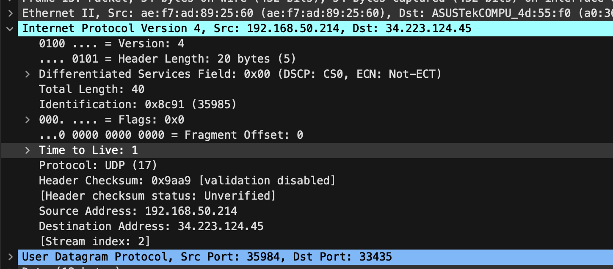
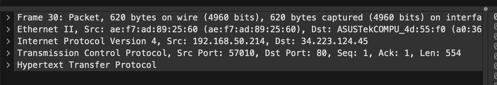
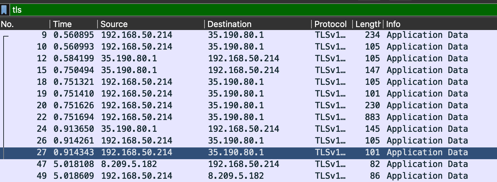
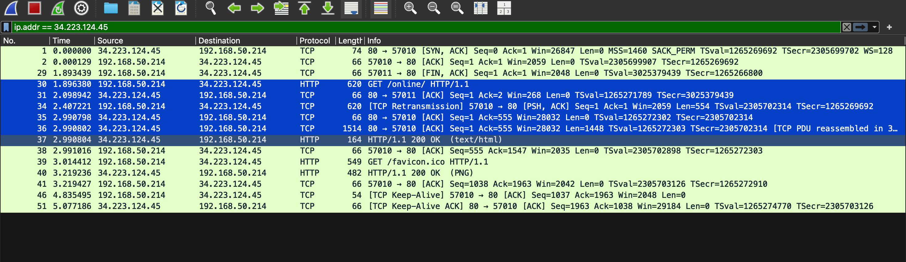

## trace

ypopov2005@MacBook-Air-Urij-2 lab_01 % traceroute oldwholeclearlight.neverssl.com
traceroute to oldwholeclearlight.neverssl.com (34.223.124.45), 64 hops max, 40 byte packets
 1  rt-ax55-55f0 (192.168.50.1)  7.531 ms  4.463 ms  3.897 ms
 2  10.224.0.1 (10.224.0.1)  7.614 ms  6.190 ms  10.286 ms
 3  81.200.19.93 (81.200.19.93)  10.444 ms  6.502 ms  6.528 ms
 4  178.176.150.2 (178.176.150.2)  7.217 ms  28.368 ms  6.583 ms
 5  83.169.204.70 (83.169.204.70)  26.782 ms
    83.169.204.74 (83.169.204.74)  25.491 ms
    83.169.204.70 (83.169.204.70)  34.209 ms
 6  79.140.90.140 (79.140.90.140)  27.082 ms  25.279 ms  39.129 ms
 7  war-b3-link.ip.twelve99.net (62.115.202.200)  105.230 ms  26.088 ms  26.834 ms
 8  hbg-bb3-link.ip.twelve99.net (62.115.120.68)  40.746 ms *  140.708 ms
 9  ldn-bb1-link.ip.twelve99.net (62.115.137.214)  53.338 ms  74.741 ms  64.168 ms
10  nyk-bb5-link.ip.twelve99.net (62.115.139.244)  121.638 ms  120.682 ms  121.561 ms
11  chi-bb1-link.ip.twelve99.net (62.115.139.33)  194.126 ms  194.121 ms  195.901 ms
12  den-bb1-link.ip.twelve99.net (62.115.115.76)  181.712 ms  166.939 ms  166.701 ms
13  * * sjo-bb3-link.ip.twelve99.net (62.115.139.104)  206.225 ms
14  * sjo-b23-link.ip.twelve99.net (62.115.139.17)  192.278 ms *
15  * * *


в wireshark ввести запрос
```icmp.type == 11 || udp.port >= 3343```



## 4. Protocol


## 5. Безопасность
Отвечает TLS, в HTTP нет


## 6. delay
0.9 ms
